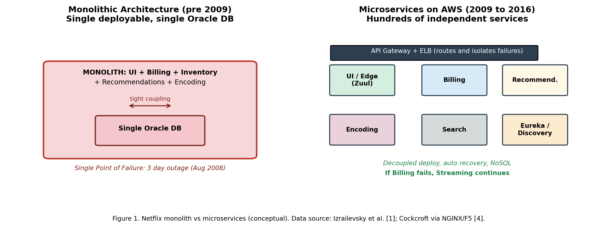
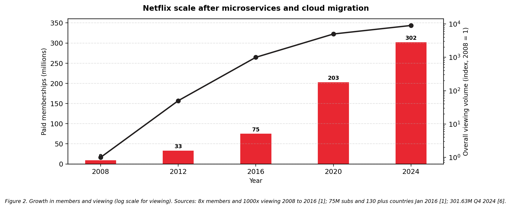
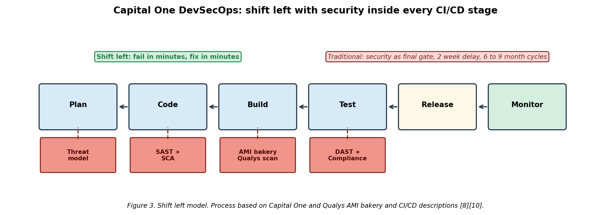
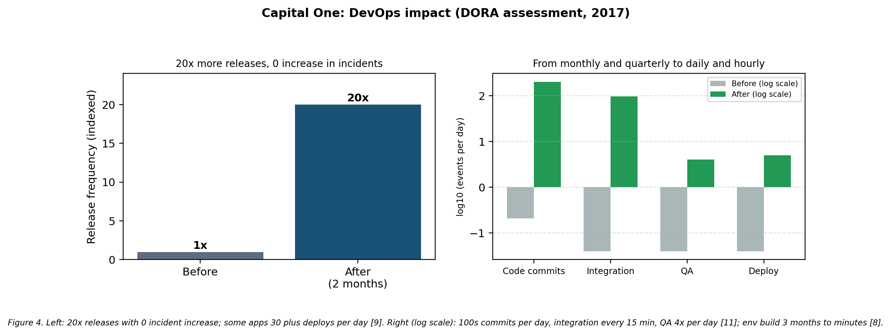

# DevOps Case Study Evaluation: CA-II

> Theory + hands-on demo: how Netflix escaped the monolith with microservices and Chaos Engineering (Q1), and how Capital One escaped 6–9 month releases with DevSecOps and shift-left security (Q2) — plus a working Flask / Docker / Kubernetes / Ansible / GitHub Actions / Prometheus demo in this repo that applies the same ideas at small scale.
>
> Source report: `DEVOPS CA2_final.docx`. All sections below are retained from that report, paraphrased and reordered for reading on GitHub. Figures and graphs are extracted verbatim from the report.

## Contents

- [Q1. Netflix: Overcoming the Monolith](#q1-netflix-overcoming-the-monolith-through-microservices-and-chaos-engineering)
- [Q2. Capital One: DevSecOps in Finance](#q2-capital-one-accelerating-innovation-in-finance-through-devsecops)
- [Hands-on Implementation in This Repository](#hands-on-implementation-in-this-repository)
- [References](#references)

---

## Q1. Netflix: Overcoming the Monolith through Microservices and Chaos Engineering

**Question:** In 2008 a database corruption stopped DVD shipments for three days and exposed the fragility of Netflix's monolith. What broke, and how did microservices + Chaos Engineering restore resilience and scale?

### Answer 1: context

In 2008 Netflix was still DVD-by-mail. UI, sign-up, billing, inventory and shipping lived in one deployable backed by a single Oracle DB in one data centre [1]. When that DB corrupted in August 2008, nothing could ship for three days [1]. Streaming (launched 2007) was about to make traffic global and bursty — the outage proved the old design could not get there [1].

### 1. Problems with the monolithic design

a) **Single point of failure.** Billing, browsing and fulfilment shared one DB, so one fault halted revenue for three days [1]. An ~11-hour outage for 7.5M subscribers in March 2008 showed the same coupling [1].

b) **Slow, risky releases.** Any edit meant rebuilding and redeploying everything. Teams could not ship independently, work bunched into big batches, and one bug forced a full rollback. ~100 engineers shared one DVD-rental app [4].

c) **Scale-up, not scale-out.** Growth meant bigger boxes, not more boxes. Provisioning physical servers took weeks, while streaming demand would soon grow 1000x [1].

d) **Manual, untested recovery.** Failover was ad-hoc and rarely drilled, so MTTR stayed high with repeated data-centre outages [1].

e) **Wrong shape for streaming.** 24/7 multi-region video, personalisation, encoding and analytics need independent scaling of hot paths (e.g. play vs. sign-up) and rapid experiments — impossible from a single DVD-logistics data centre [1][4].

### 2. How Netflix fixed it: microservices + DevOps + chaos

Netflix deliberately avoided lift-and-shift and rebuilt cloud-native on AWS from Aug 2008 to Jan 2016 [1]. Three linked moves:

(i) **Split into hundreds of microservices.** Recommendations, billing, encoding, search and personalisation each got their own store (Cassandra / DynamoDB patterns, denormalised NoSQL) [1]. Eureka (discovery), Ribbon (client-side LB), Hystrix (circuit-breaker), Zuul (edge routing) and an API gateway tie them together. Hundreds of services by 2014–15 [4], thousands today with several deploys/day [5]. A billing fault now degrades gracefully (e.g. skip a row) instead of blocking play.

(ii) **You-build-it-you-run-it teams + automation.** One release train became small owning teams with Spinnaker pipelines, IaC, central logs/metrics, tracing and fast rollback. Netflix stresses the habit change mattered as much as the code [1].

(iii) **Break things on purpose.** Chaos Monkey (~2010–11) randomly kills production instances in working hours with engineers on standby, forcing auto-recovery [2]. Latency Monkey (delays), Doctor Monkey (drains unhealthy hosts), Chaos Kong (zone/region loss) and ChAP (2017, controlled test/control trials) extend the same loop: define steady state → inject small-blast-radius fault → harden [2][3]. The Kong test paid off when US-EAST-1 actually failed.

Video was split into two planes: control/data plane in AWS, bytes via Open Connect CDN boxes inside ISPs/IXPs [1]. Compute scales fast, video serves from the edge.


*Figure 1. Monolith with a single point of failure vs decoupled microservices. Sources: [1][4].*

### 3. Effect on resilience and scalability

Availability converged toward 99.99% (~53 min downtime/year) despite rough early-cloud years [1]. Provisioning flipped from weeks to minutes: thousands of VMs + petabytes on demand [1], tens of thousands of servers + tens of petabytes by 2016, enabling 130+ countries on 6 Jan 2016 [1]. Members ~8x and viewing ~1000x in eight years [1], then 75M (early 2016) [1] → 301.63M paid memberships in Q4 2024 with 94B hours in H2 2024 (~500M hrs/day) [6]. Today: 1B+ API req/day at ~99.99% across 190+ countries [6]. A dead instance at night now shifts traffic silently — the original Chaos Monkey goal [2].

#### Table 1. Netflix before / after

| Dimension | Monolith era (~2008) | Microservices + AWS + Chaos (2016–present) |
|---|---|---|
| Outage example | 3 days unable to ship DVDs, Aug 2008 [1] | Zone/region faults auto-failover, target ~99.99% [1][3] |
| Architecture | 1 deployable + 1 Oracle DB, ~100 engineers on 1 app [4] | Hundreds of services in 2016 [1] → thousands today, several deploys/day [5] |
| Provisioning | Weeks–months to rack servers | Thousands of VMs + petabytes in minutes [1] |
| Scale | 2008 baseline | ~8x members, 1000x viewing by 2016 [1]; 75M (2016) → 301.63M (Q4 2024) [1][6] |
| Reach | Single US data centre | Multi-region AWS + Open Connect, 130+ countries Jan 2016 [1] |
| Delivery | Large, infrequent releases | Continuous delivery (Spinnaker) + daily fault injection [2][3] |

*Sources: [1][2][4][5][6].*


*Figure 2. Membership and viewing growth after migration (viewing on log scale). 8x members / 1000x viewing 2008–2016, 75M + 130 countries [1]; 301.63M Q4 2024, 94B hrs H2 2024 [6].*

**Lesson:** seven years, plus eventual consistency, tracing, ownership and cost control [1]. Speed + resilience came from the *mix* — small services, owning teams, automated delivery/recovery, chaos measurement — no single tool sufficed [1][2].

---

## Q2. Capital One: Accelerating Innovation in Finance through DevSecOps

**Question:** A top-10 US bank stuck on 6–9 month cycles under strict compliance. How did shift-left + automated scanning fix both speed and safety — and why does in-pipeline security cut incidents instead of slowing work?

### Answer 2: context

Capital One had to move fast without losing trust. It ran outsourced waterfall with manual build/test/deploy and quarterly releases [9], security as a final separate gate. Months of code then faced manual audits/pen-tests, forcing a choice between mobile features and PCI DSS / SOX / bank-review duties [8][10].

### 1. Why releases took 6 to 9 months

a) **Security only at the end.** Example: AMI approval meant emailing security and looping 48-hour scan/report rounds — ≥2 weeks per image [10]. Late faults are expensive and delay everything.

b) **Manual, batched delivery.** Integration ~monthly, testing ~monthly, manual deploys, monthly/quarterly releases [9]. A dev environment averaged 3 months to build [8]. Big batches invite more manual gates — a slowdown spiral.

c) **Compliance vs. customer pressure.** Every change needed audit evidence, while customers wanted mobile, wallet, Shopping, Eno, Alexa (first bank, Mar 2016), instant fraud alerts (Kafka/Spark/Storm) [11]. The old process could not do both.

d) **Silos.** Dev → QA → security → ops handoffs queued up; security felt like someone else's job, so faults surfaced in production [9][10].

### 2. The DevSecOps fix — what shift-left means in practice

Capital One called it DevOpsSec / Engineering Excellence: security continuous, automatic, owned by product teams — *you build it, you own it, you secure it* [10]. AWS migration ran 2013–14 trials, broad use from 2016, all eight data centres exited by Nov 2020 (first US bank all-in on public cloud) [8][11]. Controls moved from a final right-side audit into daily left-side coding (Figure 3).

(i) **Scan on every commit.** SAST, DAST, SCA/license and compliance-as-code run in Jenkins + CodePipeline/CodeDeploy (blue-green) [8][10]. Feedback in minutes, fixed on-branch — security as a fast test, not a late verdict.

(ii) **Secure-by-default images/containers.** Qualys Cloud Agent + policy checks baked into the image bakery via API for self-service scanning [10]. After one full scan only deltas report with instant live-host alerts; ~60-day fleet refresh, gold images ~biweekly [10]. Result: ~95% IP coverage (impossible with weekly scans) plus container sidecar sensors in pipeline and prod [10].

(iii) **Simpler process, shared ownership.** DORA-guided working groups: trunk-based dev with short branches, automated logged controls over manual tickets [7]; one InnerSource pipeline (Code → Build → Deploy, Test → Release → Monitor, everything-as-code) [9][12]; open-source-first reuse (e.g. Cloud Custodian) [9].

Engineers sat with product owners, agile teams owned small services, containers/microservices enabled independence. An 11,000-person tech org carried it [8][11]; small increments ship several times/day [11].


*Figure 3. Shift-left: checks inside each CI/CD stage instead of one final gate. Sources: [8][10][12].*

### 3. Results in speed and safety

More checks, yet faster — because faults are cheapest at commit, batches stay small, and machines replace queues. DORA numbers (Table 2, Figure 4): **20x releases in two months with zero incident increase**; many apps several/day, some 30+/day [7]. Team tempo: hundreds of commits/day, integration monthly → ~15 min, QA monthly → 4x/day, manual → automatic deploys, monthly/quarterly → per-sprint then daily [9]. Env build 3 months → minutes, eight DCs closed, DR tests faster, ~70% fewer transaction errors in cited tests, ~50% faster critical-incident resolution [8]. Features (Eno, Shopping, wallet, Alexa) then ship incrementally [8][11].

#### Table 2. Capital One before / after DevSecOps

| Dimension | Waterfall + end-stage security | DevSecOps + AWS cloud-first |
|---|---|---|
| Release rhythm | 6–9 months, quarterly [9] | 20x in 2 months, no extra incidents; 30+/day for some apps [7] |
| Integration / QA | Monthly / monthly [9] | ~Every 15 min / 4x per day [9] |
| Security approval | ≥2 weeks/image, 48-hr loops [10] | In-pipeline API scans, 95% IP coverage, instant alerts [10] |
| Env setup | ~3 months [8] | Minutes via IaC [8] |
| Estate | 8 owned DCs (2012) [8] | 0 by Nov 2020, first US bank fully on AWS [8][11] |
| Teams | Outsourced + handoffs [9] | 11,000 technologists, product teams own + secure [8][10] |

*Sources: [7][8][9][10][11].*


*Figure 4. Left: 20x releases, 0 incident rise; some apps 30+ deploys/day [9]. Right (log scale): 100s commits/day, integration every 15 min, QA 4x/day [11]; env 3 months → minutes [8]. Sources: DORA 2017 [7], DOES/Red Hat 2015 [9], AWS [8].*

**Why built-in security speeds delivery:** (1) cheap fixes — minutes on commit vs. weeks in final audit [10]; (2) small batches — trunk + auto-controls shrink blast radius, hence 20x without more incidents [7]; (3) steady proof — every build leaves scans/image history/agent data for PCI/SOX without human gates [10]. Limit: the 2019 cloud-config breach (not an AWS fault) proves automation ≠ no shared responsibility — policy-as-code, least privilege and posture checks need chaos-style testing too [11].

---

## Hands-on Implementation in This Repository

Mini-demo applying the same principles (microservice + automation + observability) at student scale. Originally framed as an Amazon-style two-pizza-team migration; the mechanics mirror Q1/Q2 above.

**Pipeline:** Developer → GitHub Actions → Docker build → GHCR → Kubernetes (rolling update) → Prometheus → Grafana

**Tech stack:** Flask + `prometheus-flask-exporter` · Docker · Kubernetes (Docker Desktop) · GitHub Actions · Ansible · Prometheus & Grafana

### Repo structure

- `.github/workflows/deploy.yml` — CI/CD (test → build & push to GHCR)
- `ansible/inventory.ini`, `ansible/playbook.yml` — config management (Docker, user, build/run container)
- `k8s/deployment.yaml`, `k8s/service.yaml` — K8s deploy + NodePort service (`/health` probes)
- `k8s/servicemonitor.yaml` — Prometheus scrape (`/metrics`)
- `app.py`, `requirements.txt`, `Dockerfile` — Flask microservice (`/`, `/health`, `/work`, `/metrics`)

### Pipeline flow

1. Push to `main` triggers Actions.
2. Job `test`: Python 3.11, install deps, pytest (or pass if none yet).
3. Job `build-and-push`: Buildx + `docker/metadata-action` (lowercases GHCR name) → push `ghcr.io/<owner>/<repo>:latest`.
4. K8s pulls latest with zero-downtime rolling update; Prometheus scrapes, Grafana visualises uptime/latency/errors.

### Run locally

```bash
pip install -r requirements.txt
python app.py          # http://localhost:5000, /health, /metrics
# or
docker build -t devops-demo .
docker run -p 5000:5000 devops-demo
```

### Theory → practice mapping

| Case-study idea | Demo analogue |
|---|---|
| Small owning service (Netflix/Amazon) | Single Flask service, own Dockerfile + K8s manifests |
| Automated delivery (Spinnaker / InnerSource pipeline) | GitHub Actions test + build-push |
| Secure/consistent config (image bakery) | Ansible playbook + versioned GHCR image |
| Chaos / steady proof (Chaos Monkey / shift-left scans) | `/health` probes, rolling updates, Prometheus `/metrics` + ServiceMonitor |

### Challenges faced (WSL / Windows notes)

- Ansible needs Linux → WSL2 Ubuntu + passwordless sudo for `become`.
- Port 8080 clashed with Jenkins → remapped (e.g. 9090).
- `prometheus-flask-exporter` prefixes `flask_` — adjust PromQL.
- Docker Desktop/WSL2 needed extra memory via `.wslconfig` for monitoring stack.
- GHCR image names must be lowercase — fixed via `docker/metadata-action`.

---

## References

[1] Y. Izrailevsky, S. Vlaovic and R. Meshenberg, Completing the Netflix Cloud Migration, Netflix TechBlog / About Netflix, Feb. 11, 2016. Aug. 2008 DB corruption (3 days no DVDs), 7-year migration to Jan. 2016, monolith → hundreds of microservices + NoSQL, 8x members / 1000x viewing, ~99.99%, thousands of servers + petabytes in minutes, 130+ countries Jan. 6, 2016. https://about.netflix.com/news/completing-the-netflix-cloud-migration

[2] Y. Izrailevsky and A. Tseitlin, The Netflix Simian Army, Netflix TechBlog, July 19, 2011. Chaos Monkey kills prod instances in hours with engineers on standby + Simian Army. https://netflixtechblog.com/the-netflix-simian-army-16e57fbab116

[3] C. Rosenthal and N. Jones, Chaos Engineering: System Resiliency in Practice, O'Reilly, 2020, via A. Lawson, InfoWorld, May 13, 2020. Chaos Kong, ChAP (2017), steady-state / blast radius. https://www.infoworld.com/article/2257835/what-is-chaos-monkey-chaos-engineering-explained.html

[4] T. Mauro, Adopting Microservices at Netflix, NGINX/F5 Blog, Feb. 19, 2015 (after A. Cockcroft, Aug. 2014). ~100 engineers on 1 DVD monolith → many teams, hundreds of services. https://www.f5.com/company/blog/nginx/microservices-at-netflix-architectural-best-practices

[5] Netflix Tech Blog, From Silos to Service Topology, May 29, 2026 / InfoQ June 5, 2026. Thousands of services, several deploys/day, live dependency graph. https://www.infoq.com/news/2026/06/netflix-microservices-realtime

[6] Netflix, Inc., Q4 2024 Shareholder Letter, Jan. 2025. 301.63M memberships, 94B hours H2 2024; ~99.99%, 190+ countries, 1B+ API req/day (via AWS Plain English synthesis, July 2025). https://aws.plainenglish.io/how-netflix-serves-300-million-users-without-owning-a-single-server-b2c31d0190cb

[7] DORA, Capital One Drives Continuous Delivery Improvement, Apr. 2017. 20x releases in 2 months, no incident rise; trunk + auto-approvals; 30+ deploys/day. https://services.google.com/fh/files/misc/capital_one_case_study.pdf

[8] AWS, Capital One All-In on AWS Case Study. 8 DCs closed, env 3 months → minutes, 11,000 tech staff, 30+ AWS services. https://aws.amazon.com/solutions/case-studies/capital-one-all-in-on-aws

[9] T. Pal (Capital One) via R. Dobson, Red Hat Developers Blog, Oct. 20, 2015. Quarterly manual → 100s commits/day, integration every 15 min, QA 4x/day, auto-deploy, per-sprint releases. https://developers.redhat.com/blog/2015/10/20/capital-one-banking-on-innovation-devops-open-source

[10] Qualys, Capital One: Building Security Into DevOps, 2018 + Wilson/Csech QSC 2018 slides. Image bakery, 2-week/48-hr manual → API Qualys + Cloud Agent, 95% IP coverage, instant deltas, 60-day refresh, container sidecar. https://www.qualys.com/customers/success-stories/capital-one-building-security-devops

[11] C. Boulton, CIO, Oct. 25, 2016 + Business Insider, Nov. 10, 2020. Engineering Excellence, containers/microservices, Alexa Mar. 2016; 8 DCs exited, first US bank fully on cloud. https://www.cio.com/article/236417/capital-one-shifts-to-devops-to-keep-pace-with-customers.html

[12] Capital One Tech, Building a Singular Software Delivery Pipeline, Feb. 20, 2024. InnerSource Code → Build → Deploy / Test → Release → Monitor, everything-as-code. https://www.capitalone.com/tech/open-source/innersource-singular-software-delivery-pipeline
